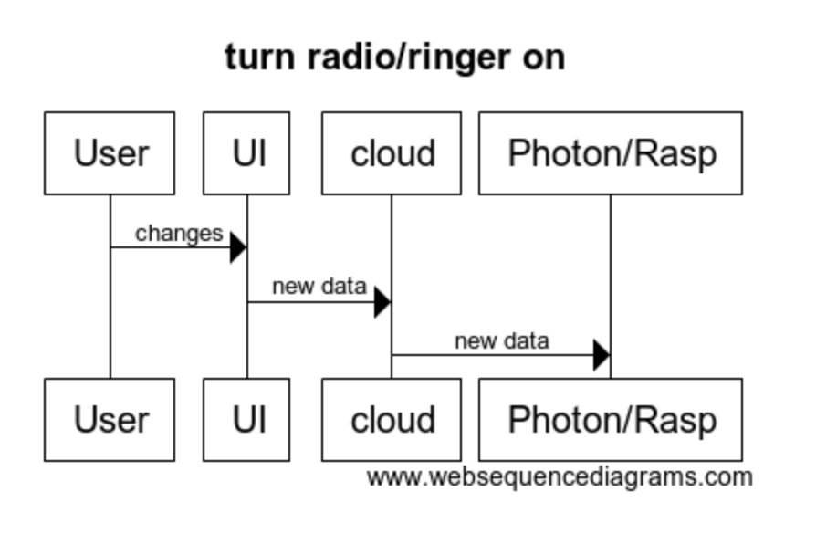

# 1. Description

Safety is and has always been a major concern for humans in general which is the reason we live in houses and apartments. However, even though these shelters protect us from nature, there still exists the danger of criminals who want to break in and steal items from our homes and/or hurt our families.

Our solution to this problem is to implement a motion sensor at the front door to detect if a person is approaching the house. We also plan of having a camera setup, so the user can monitor any action outside the home. This will be useful especially when motion is detected at the front door and the user can just look at the camera feed on their phone to see who is at the front door. In addition, there will be a safe mode in which the user will be able to boost security. While in this mode, if the system detects a threat, a loud siren will go off alerting the user and also, hopefully scaring away the criminal.

This product would likely be most useful to home and apartment owners who what to protect and monitor the front door of their home. If could also be used for stores in order to stop break-ins and help monitor stealing during the day because of the camera we will install.

Using IoT is beneficial here because we will be able to send alerts to the user through the internet to their phone, tablet, computer, etc. This will be useful especially if the user is away from their home and want to monitor their home. The costs for this project will not be that bad, as no super expensive hardware is used to make the product (camera, servo motor, buzzer, motion sensor, and photon). I would imagine installing everything to the building would be the hardest part, however, people will pay for this product because people will do anything in order to protect their live, their family, their home, and their possessions.

Overall, this would be a great product to help increase the security of a home or store. It will help you protect you, your family, and all of your personal belongings as well.

# 2. Hardware and Cloud Infrastructure Needed

## Hardware:

Base hardware:
- Photon (have)
- Motion sensor (for door state or detect if person is approaching)(have) or some other type of sensor to detect door state
- Piezo buzzer (have) //maybe or could do the pirate radio
- Use led or OLED to display alarm status

Hopeful hardware:
- Camera (don't have) //maybe
- Servo motor (have) //with the camera

Extra above an beyond stuff:

- Raspberry pi (have)
- Leap Motion Controller (have)
- Ac outlet controller (have)

Prob wont use but could:
- OLED (have) //don't need
- IR light for controlling a tv (have) //don't Need
- temperature sensor (have) //don't need

## Cloud Infrastructure:

- Possibly accessing weather or schedule
- Sending video/audio over the cloud
- Particle

# 3. Unknowns and Challenges

Do not have experience with many things we might do, such as the leap motion or using a camera.
But on the base idea, it shouldn't be THAT bad. Although, we haven't used motion sensor before.
For detecting door status, might be best to use the motion sensor, or maybe a closed sensor like with garage, or a magnet type sensor like in typical alarm systems.

Might have to get a camera or microphone if we want to incorporate that stuff.

# 4. User Stories & Usage Scenarios

- Imagine you are a concerned parent who lives in a neighborhood with decently high crime rates. You currently have no protection for your home. You just found out that the other day your next-door neighbor was robbed at gunpoint. You are scared for you and your family’s safety and wish there was a product to provide security.

- Imagine you have to travel for the holidays from your home in Chicago to California. When you come back from the trip you see the front door opened, and your home is trashed. You were robbed. You wish you would have had a security system that would have alerted you and authorities as soon as the break-in started.

- Imaging you are a single parent who has an important last-minute meeting you must attend, and you have to leave your kids at home. You are scared to leave them at home but are forced to. While driving to your meeting you think to yourself, “I wish there was a way I could monitor the door so I can make sure my kids don’t let a stranger in.”

# 5. Paper Prototypes

- Home Screen: On the home screen we have the current status of whether the alarm is on or off, the status of the door, and the time the door was last opened. Additionally, there is a toggle button to turn the alarm on or off and a button to contact the emergency number.At the bottom of the scree is a navigation bar to the camera and settings screens.

- Camera: On the camera screen there is live video of what the camera is seeing. There is a bar to control which way the camera is facing, and a talk button which will allow the user to communicate with whomever is at the door.

- Settings: In setting there is a toggle button to turn off the ringer and radio. There is also a box to enter the radio frequency. The emergency contact number and password can also be change on this page.

# 6. Implementation: Sequence Diagrams

- The user clicks send emergency text on the UI which sends data to the cloud then to the photon/raspberry pi and then to the IFTTT

- The user controls the camera using the slider on the UI, this translates into servo data which is sent to the cloud and then to photon/raspberry pi. This moves the camera and updates the video to the cloud and then the UI.

- User clicks the talk button on the UI and speaks into microphone.The audio is sent to the cloud then to the photon/raspberry pi, and eventually comes out of the speaker.

- The user changes the password on the UI which is sent to the cloud and then the photon/raspberry pi.

- The user toggles the radio/ringer on the UI which is sent to the cloud and then the photon/raspberry pi.

# 7. Plan and Schedule

## Weekly Schedule / Progress

| Week End     | Deliverables & Accomplishments |
|:-------------|:-------------------------------|
| By Nov 11    | Have any necessary parts ordered. Have UI and development plans solidified|
| By Nov. 18   | Have motion sensor and basic UI.|
| By Dec. 3    | Clean it up.  Maybe Add camera/motor or cool new features! i.e. raspberry pi, Ac outlet controller|
| Dec. 5       |  Complete Project Due!         |

## Group Member Responsibilities (Groups only)

| Name         | Responsibilities |
|:-------------|:-----------------|
|  Reid Meyer  |  50%  Hardware, Cool stuff|
| Andrew Mitra |  50%  UI, Cloud           |

## Times Reserved for Project Work

Fill in a schedule of times reserved for the project.  If you can't set regular weekly times, create a schedule based on specific days.

These are all the times we are both available to meet up every week. We will meet every Saturday to update each other on our work and talk over how we think things are going with the project. Emergency meet times can be called during any of these time periods.

| Week Day | Times | Who (if on a team) |
|:---------|:------|--------------------|
| Monday   | 5-6      |     everybody      |
| Tuesday  |12-2,6-10 |     everybody      |
| Wednesday| 5-10     |     everybody      |
| Thursday | 12-3     |     everybody      |
| Friday   |all day   |     everybody      |
| Saturday |all day   |     everybody      |
| Sunday   |12-3      |     everybody      |

## Bonus Credit

If we use Raspberry pi, Leap motion, Outlet controller, Ir light for tvs, a camera, or even the base motion sensor, I would consider that bonus.
Bonus = not done in class.
