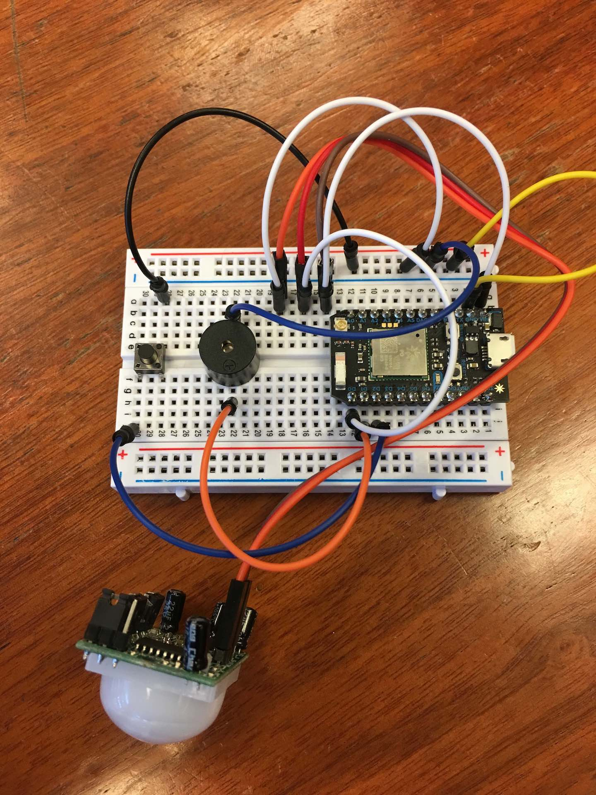
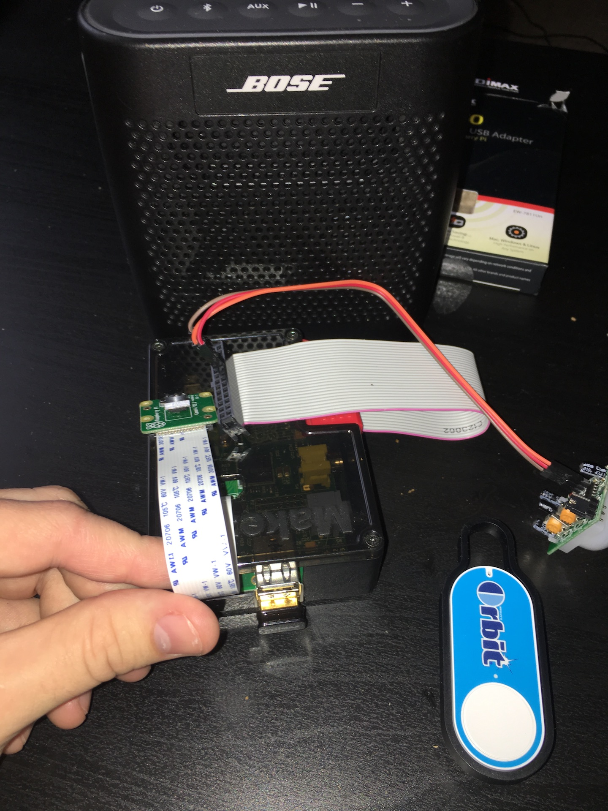

HTML Update
- The HTML is mostly done. Planning on putting a log of times people come up to the door and a notification when the system is arming and when the alarm goes off.

CSS Update
- The CSS hasn't really changed from our last update. Will probably have to add more styling for the log and notification

JS Update
- The JS is pretty much all done just need to add notifications in and may have to add one more thing to be read in through the stream

Hardware Update
- Have 2 buttons, a piezo buzzer, and PIR motion sensor hooked up.
- Hooked up a camera to the raspberry pi, and made it so I can ssh in and run it headless.
- have a wifi adapter hooked up to pi so we can demo on campus
- got powerswitch tail 2 working
- have the pi hooked up to a speaker through an audio cord

.ino Update
- INO code is basically done might add some more features and update the streams a little bit.

Cloud Update
- Cloud stuff is mostly done will probably need to update the streams though

Raspberry Pi Update
- Can ssh into the pi
- Hooked the Pi up to the particle console. It has GPIO functions built in
- Bought a pi Camera and can use the raspivid library to control it.
- NC Streaming (not gonna use)
- Photos taken on movement and saved to apache web server. Option to send online through ngrok
- videos taken. used MP4Box to convert from .h264 to .mp4 so it could be viewable in web browsers
- have amazon dash button working. python program sniffs on network and plays audio file when button click detected (doorbell)

IFTTT Update
- Texting function send alert 20 seconds after the alarm is set off

Problems and concerns
- Our most major concern is that the internet on campus is not the best and when we fake demoed in TA hours it was hard to get everything connected correctly. Our best solution is that we will have to demo upstairs where cellular and internet connection is better.

Priorities for the next week
- Clean things up
- add a log of times
- add notifications to website

Photo

- Current photon hardware setup with arming button, piezo buzzer, and PIR motion sensor

- Current pi hardware setup with speaker, wifi dongle, pi camera, pir sensor, and amazon dash button
